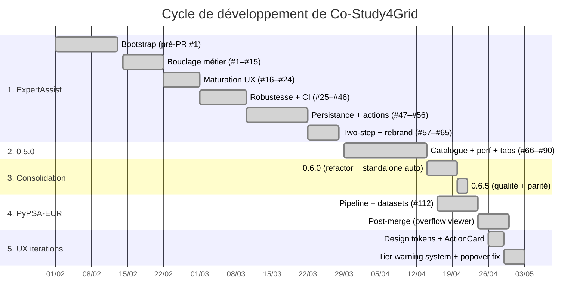
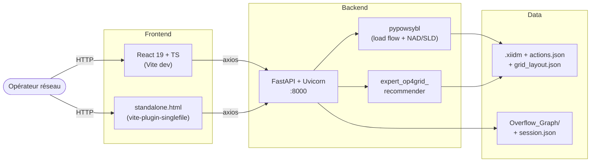
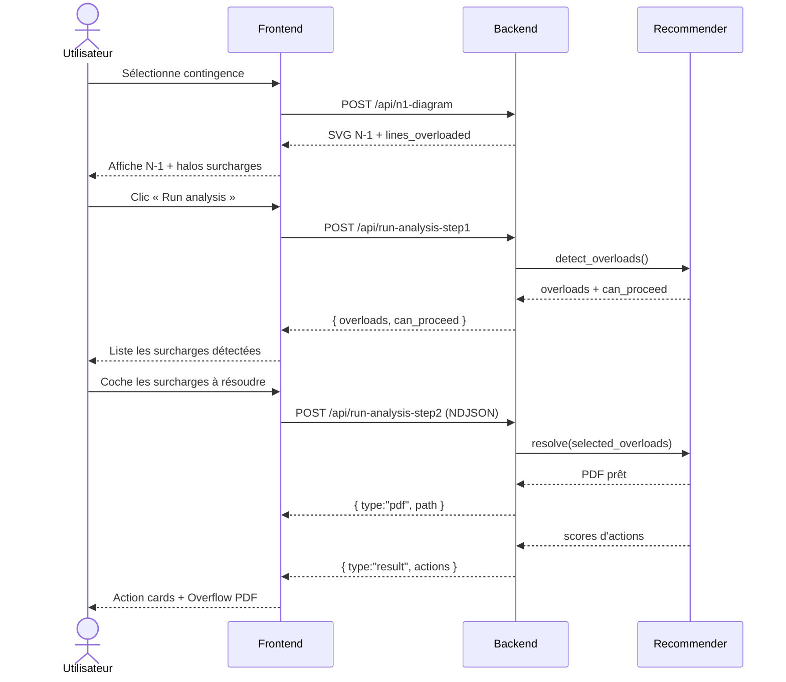
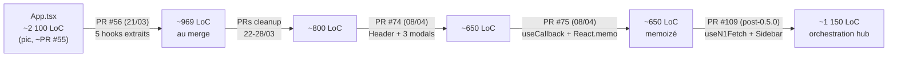
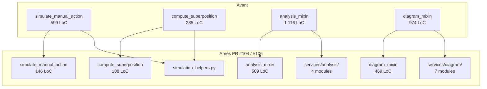
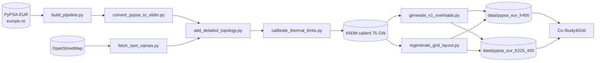

# Cycle de développement de Co-Study4Grid

> Résumé du cycle de développement reconstruit à partir du `git log`
> (358 commits, du 28/03/2026 au 30/04/2026), du `CHANGELOG.md` et
> des descriptions de PRs depuis GitHub. Pour les 65 PRs antérieures
> au rebrand (`ExpertAssist`, 14/02 → 28/03/2026), absentes du clone
> local de `Co-Study4Grid`, les métriques s'appuient sur le clone
> de `marota/ExpertAssist` (783 commits, premier commit `9218c4c`
> du 13/02/2026) en plus des descriptions de PR.

Ce document est une vue d'ensemble chronologique des grandes phases
du projet. Pour les détails par sujet, voir les docs ciblées :

- Audit qualité 2026-04 : [`code-quality-analysis.md`](code-quality-analysis.md)
- Refactor `App.tsx` : [`app-refactoring-plan.md`](app-refactoring-plan.md),
  [`phase2-state-management-optimization.md`](phase2-state-management-optimization.md)
- Pipeline PyPSA-EUR → XIIDM : [`../data/pypsa-eur-osm-to-xiidm.md`](../data/pypsa-eur-osm-to-xiidm.md)
- Audit de parité standalone : [`../../frontend/PARITY_AUDIT.md`](../../frontend/PARITY_AUDIT.md)

## Vue d'ensemble

### Chronologie



### Architecture d'ensemble



---

## 1. Mise en place d'une base minimale de bout en bout — ère « ExpertAssist » (14/02/2026 → 28/03/2026, PRs #1 → #65)

Le clone local n'expose plus que les commits postérieurs à la bannière
MPL-2.0 (`426b6f7`, 28/03/2026), juste après le rebrand. Mais sur
GitHub, l'historique pré-0.5.0 est riche : **65 PRs en ~6 semaines**,
sous le nom *ExpertAssist*. Ce paragraphe les consolide à partir des
descriptions de PR (et non plus du seul `CHANGELOG`, qui les agrège
sous *Earlier Development (pre-0.5.0)* sans les énumérer). Le projet
arrive en 0.5.0 (14/04/2026) avec la quasi-totalité de l'architecture
encore en place aujourd'hui ; ce qui suit est donc plus qu'un
préalable — c'est l'essentiel du socle.

### 1.1. Bootstrap — commit d'init `9218c4c` (vendredi 13/02/2026 13:25)

Le tout premier commit du repo `marota/ExpertAssist` s'intitule
sobrement *« initialisation of ExpertAssist interface »* : **44
fichiers, 2 513 insertions** poussées d'un seul jet. Le scaffolding
n'arrive donc pas vide à PR #1 — il arrive déjà fonctionnel de bout
en bout, sur ~2,5 k LoC.

**Backend (130 + 384 + 52 LoC)** — `expert_backend/main.py` expose
**7 endpoints** :

```
POST /api/config              GET  /api/network-diagram
GET  /api/branches            POST /api/n1-diagram
GET  /api/voltage-levels      POST /api/run-analysis  (NDJSON streaming)
GET  /api/pick-path           ↳ via tkinter en subprocess
```

Le `RecommenderService` charge déjà le réseau via **pypowsybl**,
génère NAD pour N et N-1, et orchestre le recommender en
`StreamingResponse`. **CORS wide-open**, mount static
`/results/pdf → Overflow_Graph/`, et la fenêtre OS-native pour
choisir un fichier ou un dossier sont *présents au commit zéro*.

**Frontend (35 LoC `App.tsx` + 19 LoC `api.ts`)** — un shell React
de **3 composants** (`ConfigurationPanel` 92 LoC, `VisualizationPanel`
33 LoC, `ActionFeed` 43 LoC). Le client `axios` ne propose que
`updateConfig` / `getBranches` / `runAnalysis`. Le titre de l'app
est encore **« Expert_op4grid Recommender Interface »** ;
*ExpertAssist* en sera le nom de produit.

**Standalone** — `standalone_interface.html` est déjà à **755 LoC**.
Il sera maintenu en parallèle de la SPA pendant toute la durée de
l'ère ExpertAssist.

**Outillage de dev embarqué** — 5 scripts ad-hoc pour reproduire les
problèmes observés pendant le bootstrap : `test_api_stream.py`,
`test_n1_api.py`, `test_voltage_api.py`, `verify_n1_simulation.py`,
`inspect_metadata.py`, plus `repro_stuck.py` et `fix_zoom.py`.
Deux Overflow Graphs PDF sont commitées comme exemple-jouet.

> Le projet *naît* avec le streaming NDJSON et le triangle
> *config → branche → analyse* déjà bouclé. Tout ce qui suit est
> de l'enrichissement.

### 1.2. Bouclage métier de bout en bout (14 → 22/02/2026, PRs #1 → #15)

Première semaine de PRs : on rend le triangle *réseau → contingence →
action* utilisable de bout en bout. **À l'arrivée (commit `35646f6`,
21/02)** :

| Fichier                           | Init     | Après PR #15 | × |
|-----------------------------------|----------|--------------|---|
| `frontend/src/App.tsx`            | 35       | 617          | ×17 |
| `frontend/src/components/VisualizationPanel.tsx` | 33   | 260          | ×8  |
| `expert_backend/main.py`          | 130      | 233          | ×1,8 |
| `expert_backend/services/recommender_service.py` | 384  | 636          | ×1,7 |
| `standalone_interface.html`       | 755      | 2 100        | ×2,8 |
| Endpoints backend                 | 7        | 13           | +6  |

Endpoints ajoutés sur la fenêtre : `/api/nominal-voltages`,
`/api/action-variant-diagram`, `/api/element-voltage-levels`,
`/api/focused-diagram`, `/api/actions`, `/api/simulate-manual-action`.

Les PRs, par ordre de merge :

- **PR #1 (14/02)** — *NAD rendering for large grids* : `boostSvgForLargeGrid()`
  (scale fonts/labels/legends en `sqrt(taille/référence)` au-delà de
  1,5× la référence), extraction des helpers backend (`_load_network`,
  `_load_layout`, `_default_nad_parameters`, `_generate_diagram`),
  endpoints `GET /api/element-voltage-levels` + `POST /api/focused-diagram`
  pour les sous-diagrammes centrés sur un équipement.
- **PR #2 (14/02)** — première version du `CLAUDE.md` (160 lignes,
  référence projet pour humains et assistants).
- **PR #4 (15/02)** — README projet.
- **PR #5 (15/02)** — pan/zoom + métadata lookups optimisés.
- **PR #6 (16/02)** — *ActionFeed* avec données `rho` structurées.
- **PR #7 (16/02)** — `/api/action-variant-diagram` + sélection
  interactive d'actions sur la N-1.
- **PR #8 (16/02)** — pré-calcul de l'état réseau pour accélérer
  les variantes d'action.
- **PR #9 (17/02)** — *highlights* des lignes en surcharge et des
  cibles d'action sur la SVG.
- **PR #11 (18/02)** — **actions manuelles** simulables côté UI.
- **PR #12 (19/02)** — mode **delta flows** (Δ versus N-state).
- **PR #13 (19/02)** — filtres par voltage level.
- **PR #14 (20/02)** — intégration des **scores estimés** pour les
  actions manuelles (la colonne *score* devient utilisable avant
  simulation complète).
- **PR #15 (21/02)** — refonte majeure de la visualisation : le hook
  `usePanZoom` (manipulation directe du viewBox SVG en bypass de
  React), le module `svgUtils.ts` (`processSvg`, `buildMetadataIndex`
  O(1), `applyOverloadedHighlights`, `applyActionTargetHighlights`,
  `applyDeltaVisuals`, `boostSvgForLargeGrid`), le **multi-tab indépendant**
  N / N-1 / action / overflow et le streaming SSE des résultats.
  `VisualizationPanel` passe de 397 à 259 lignes.

### 1.3. Maturation UX/UI (22/02 → 01/03/2026, PRs #16 → #24)

- **PRs #16–#18 (22/02)** — assets cliquables sur les action cards,
  tooltips en `position: fixed` (debord clean), overlay SLD draggable.
- **PR #19 (27/02)** — **Recommender Settings panel** complet :
  sliders pour `min_line_reconnections`, `min_close_coupling`,
  `min_open_coupling`, `min_line_disconnections`, `n_prioritized_actions` ;
  flow *Apply / Close* avec backup pour annuler ; auto-apply +
  banner dynamique pour le `lines_monitoring_path` ;
  panneau settings tabbé *Recommender / Configurations*. La PR fixe
  aussi le **bug du score 0,00 sur les disconnections** quand
  `lines_monitoring_file` est actif (correction de
  `expert_op4grid_recommender/action_evaluation/discovery.py`) et
  re-mémoise `actions.json` côté backend pour rendre les hot-swaps
  de settings instantanés.
- **PR #20 (28/02)** — **OverloadPanel** compact en haut de la sidebar
  (lignes en surcharge N + N-1, clic = zoom), **`monitoringFactor`**
  (`MONITORING_FACTOR_THERMAL_LIMITS`, default 0,95) propagé partout :
  détection backend `_get_overloaded_lines`, mise à l'échelle des
  `rho_before/rho_after/max_rho`, seuils de coloration des
  action cards.
- **PR #21 (28/02)** — exclusion des surcharges pré-existantes en N-1
  sauf si **aggravées** par la contingence.
- **PRs #22–#24 (01/03)** — filtres par type d'action ; persistence
  des actions manuelles ; restructuration du layout ; *state-switching*
  des SLD (le diagramme suit l'onglet actif).

### 1.4. Robustesse + CI + perfs (01 → 10/03/2026, PRs #25 → #46)

C'est la phase où la base devient testable et fiable :

- **PR #25 (01/03)** — **suite de tests** complète : backend
  (`test_api_endpoints.py`, `test_network_service.py`,
  `test_compute_deltas.py`, `test_sanitize.py`) avec un
  `conftest.py` qui mocke `pypowsybl` / `expert_op4grid_recommender`
  pour CI, frontend (`api.test.ts`, `svgUtils.test.ts`,
  `VisualizationPanel.test.tsx`, `OverloadPanel.test.tsx`) sous
  Vitest + RTL.
- **PR #28 (02/03)** — **CircleCI + GitHub Actions** en parallèle
  (Python + React/Vitest/ESLint), `pyproject.toml` introduit. À ce
  point : 80 tests backend + 66 frontend.
- **PR #26** — pan/zoom batché en interaction state.
- **PR #27** — clustering des voltage levels détectés + bucket
  sous 25 kV.
- **PR #29** — exclusion des branches non monitorées.
- **PR #30** — bouton **« Make a first guess »** + warnings clarifiés.
- **PRs #31–#32** — calcul des deltas terminal-aware avec sélection
  par VL, intégration de la puissance réactive.
- **PRs #33–#35** — fix SLD voltage diagram, modes
  `IGNORE_RECONNECTIONS` / `PYPOWSYBL_FAST_MODE`, refactor du
  `RecommenderService` pour la consistence des simulations.
- **PRs #36–#38** — recherche SLD synchronisée entre tabs,
  **lazy-loading des actions** côté recommender.
- **PRs #39–#41** — fix sérialisation NaN (`Infinity` → `null`),
  UI de non-convergence (tags *divergent*, warnings orange,
  tests unitaires), réintroduction des actions manuelles différées.
- **PR #46 (10/03)** — latence de tab-switch + optimisation SVG.

### 1.5. Persistance + actions complexes (10 → 22/03/2026, PRs #47 → #56)

- **PR #47** — **confirmation dialogs** pour le changement de
  contingence et le reload d'étude.
- **PR #48** — enrichissement de la topologie d'action avec `pst_tap`.
- **PR #49 (11/03)** — **save session** : `session.json` + copie du
  PDF *overflow graph* + theme jaune cohérent + auto-fade des
  notifications + `test_save_session.py`.
- **PR #50** — reset propre de l'état de contingence.
- **PR #51 (14/03)** — **islanding MW reporting** + highlights
  multi-assets pour les actions combinées.
- **PR #52 (17/03)** — **reload session** + persistance des paires
  combinées :
  - `/api/list-sessions` + `/api/load-session` + bouton dédié dans
    le banner.
  - Restauration sans re-simulation (rho values + status tags
    sauvegardés sont réaffichés tels quels ; la simulation ne se
    déclenche qu'à la sélection d'une action).
  - `restore_analysis_context()` côté backend pour conserver
    `lines_we_care_about` (consistence du monitoring entre runs).
  - Reconstruction de la topologie d'action depuis les données
    sauvegardées pour les actions absentes du dictionnaire courant.
  - Suppression des dialogs de changement de contingence pendant
    le restore via `restoringSessionRef`.
- **PRs #53–#54** — détection PST robuste dans les actions combinées,
  highlights de contingence orange.
- **PR #56 (21/03)** — **App.tsx Phase 1** : extraction de **5 hooks**
  (`useSettings`, `useActions`, `useAnalysis`, `useDiagrams`,
  `useSession`) ; `App.tsx` passe **2 100 → 969 lignes** au merge
  (la cible de la PR description était ~800, atteinte dans les PRs
  suivantes par cleanup). C'est aussi la PR qui introduit
  `docs/app-refactoring-plan.md`.

### 1.6. Two-step analysis, replay-ready logging et rebrand (22 → 28/03/2026, PRs #57 → #65)

Dernière vague avant le tag 0.5.0, qui pose la majorité des
contrats utilisateur encore en vigueur :

- **PR #57 (22/03)** — **split de l'analyse en deux étapes** :
  `runAnalysisStep1` (POST → `can_proceed`, détection des
  surcharges) puis `runAnalysisStep2Stream` (POST avec
  `selected_overloads` / `all_overloads` / `monitor_deselected`,
  réponse streaming NDJSON). Sélection intelligente : préserve les
  surcharges déjà sélectionnées si elles intersectent les nouvelles,
  fallback all-detected sinon. Test coverage massive sur
  `useAnalysis` (396 lignes).
- **PR #58 / #60** — *interface discrepancies* React/standalone.
- **PR #59 (24/03)** — **persistance config** sur disque :
  `config.default.json` (templaté, tracké) + `config.json`
  (auto-créé, gitignoré) + endpoints `GET/POST /api/user-config`.
  Remplace l'ancien `localStorage`.
- **PR #61 (25/03)** — **action de délestage de charge** intégrée :
  paramètre `MIN_LOAD_SHEDDING`, calcul du delta MW shedded dans
  `_enrich_actions` et `simulate_manual_action`, badges VL verts
  cliquables et `get_load_voltage_levels_bulk()` côté backend.
- **PR #62 (25/03)** — colonne **MW Start** sur les action scores
  (line disconnection : `abs(p_or)` ; PST tap : `abs(p_or)` du PST ;
  load shedding : `load_p` ; open coupling : somme des `abs(p_or)`
  des virtuelles, etc.).
- **PR #63 (26/03)** — **SLD impact highlights** : 4 styles
  distincts (orange contingencies / yellow actions / dashed-orange
  overloads / purple breakers), avec lookup d'équipement à fallback
  multiples (sanitization dot/underscore + substring SVG ID),
  enrichissement backend `pst_tap` + `substations` + `switches`.
- **PR #64 (27/03)** — **interaction-logging replay-ready** :
  `InteractionLogger` singleton, 50+ types d'événements, `seq` +
  ISO timestamp + correlation ID pour les paires async start/complete,
  sauvegarde dans `interaction_log.json`, design doc 655 lignes
  + `docs/interaction-logging.md` (456 lignes).
- **PR #65 (28/03)** — **rebrand `ExpertAssist` → `Co-Study4Grid`**
  (1 commit, 18 fichiers, +26/−1998 — purge des références au
  vieux nom et nettoyage). C'est ce point qui ouvre l'historique
  git visible localement.

#### Flux d'analyse en deux étapes (PR #57)

Le contrat utilisateur principal posé par cette dernière vague :



> **Bilan de la phase ExpertAssist** : 65 PRs sur 6 semaines, des
> couches de scaffold + visualisation NAD multi-tab à un workflow
> N-1 deux-étapes streamé, avec persistance de session, interaction
> logging, mocks de CI et la première extraction d'`App.tsx` en hooks.
> La 0.5.0 (14/04/2026) ne fait qu'apposer un tag sur cet ensemble et
> ajouter le catalogue d'actions complet (PST, curtailment) +
> les vectorisations perf — l'architecture qui sous-tend ce qui
> existe aujourd'hui est bâtie ici.

## 2. Premier tag de release : 0.5.0 (29/03 → 14/04/2026, PRs #66 → #~95)

Le tag 0.5.0 (14/04/2026) entérine **l'architecture ExpertAssist
au complet** (cf. § 1) et y ajoute, en deux semaines :

1. les optimisations perf qui rendent le réseau français interactif,
2. le catalogue d'actions remédiales final (curtailment, PST tap,
   load shedding au nouveau format `loads_p`/`gens_p`),
3. la première décomposition de `App.tsx` côté composants,
4. les onglets de visualisation détachables pour multi-écran.

> **Note de réconciliation** : les briques *save / reload session*,
> *interaction-logging rejouable*, *MW Start* et *highlights SLD*
> (PRs #49 / #52 / #62 / #63 / #64) sont en fait pré-rebrand —
> elles arrivent en 0.5.0 par le simple effet du tag, sans nouveau
> code dans cette fenêtre. Voir § 1.5–1.6.

### 2.1. Vectorisation backend (PR #66, 29/03)

Première PR post-rebrand. Cible la latence de
`simulate_manual_action` sur le réseau français complet (~10 k
branches) :

| Étage                              | Avant     | Après    | Speedup    |
|------------------------------------|-----------|----------|------------|
| `care_mask` + détection surcharges | 12,17 s   | 0,01 s   | **1 100×** |
| Extraction des flux                | 0,82 s    | 0,06 s   | **13×**    |
| Calcul des deltas terminal-aware   | 0,47 s    | 0,01 s   | **47×**    |
| Cache d'observations (boucle)      | —         | —        | **~65×**   |
| **Total simulation manuelle**      | **16,5 s**| **4,0 s**| **4×**     |

Tests dédiés : `test_vectorized_monitoring.py`,
`test_cache_synchronization.py`, `test_performance_budgets.py`
(SLA logique sous 50 ms).

Une stratégie *viewport-based subsets* (50× de payload) a été
prototypée puis **rejetée** dans la même PR — perte d'intégrité du
highlighting global ; les retours d'expérience vivent dans
`docs/proposals/rendering-lod-strategies.md`.

### 2.2. Polish UI + parité standalone (PRs #69 → #71)

- **PR #69** — restauration du chargement de `grid_layout.json`
  (fix régression layout) + tests de non-régression.
- **PR #70** — fix latence affichage *Overflow Graph* + tab-switch
  standalone, throttling `datalist`, garde-fou zoom sur match exact,
  fix `NaN` dans le SVG boost.
- **PR #71** — uniformisation des highlights React + standalone :
  suppression des `drop-shadow`, opacité solide pour overloads,
  actions et contingencies, fix dimming des cibles d'action.

### 2.3. Catalogue d'actions remédiales final (PRs #72, #73, #78)

- **PR #72 (01/04)** — branche `feature/renewable-curtailment-integration` :
  `simulate_manual_action` retourne `action_topology` immédiatement
  (sync UI instantanée), descriptions unifiées (`'GEN' at voltage
  level 'VL'`), enregistrement des actions manuelles dans le
  registre central (SLD highlights), fix du signe MW
  curtailé/sheddé, badges interactifs (générateurs/charges/VL).
- **PR #73 (07/04)** — support du **nouveau format `loads_p` / `gens_p`**
  pour load shedding et curtailment (active power setpoints au lieu
  de `bus = -1`) :
  - Backward-compat plein avec le format legacy
    (`loads_bus` / `gens_bus` à `-1`).
  - `_compute_load_shedding_details`, `_compute_curtailment_details`,
    `_mw_start_*` détectent les deux formats.
  - 553 lignes de tests dédiées (`test_power_reduction_format.py`).
  - **MW configurable** côté UI + ré-simulation depuis la table de
    score.
- **PR #78 (09–11/04)** — **PST tap re-simulation** :
  `_compute_pst_details()` extrait `low_tap` / `high_tap` du
  network manager ; `simulate_manual_action(target_tap=…)` clamp
  automatiquement aux bornes ; UI éditable (purple theme) avec
  bouton *Re-simulate* per-action.

### 2.4. Décomposition `App.tsx` post-rebrand (PRs #74, #75)

- **PR #74 (08/04, Phase 1 *Component Decomposition*)** —
  extraction des 4 composants top-level hors d'`App.tsx` :
  `Header`, `SettingsModal` (qui reçoit le `SettingsState` complet
  du hook `useSettings`), `ReloadSessionModal`, `ConfirmationDialog`.
  `App.tsx` passe de **~1 000 → ~650 lignes**.
- **PR #75 (08/04, Phase 2 *State Management Optimization*)** —
  **rationalisation des re-renders** :
  - 9 wrappers cross-hook mémoizés via `useCallback`.
  - `clearContingencyState()` / `resetAllState()` extraits pour
    déduplication (25+ lignes de resets manuels par appelant).
  - 8 callbacks JSX inline → handlers nommés `useCallback`.
  - 9 settings groupés dans un `RecommenderDisplayConfig`
    mémoizé (un prop au lieu de 9 vers `ActionFeed`).
  - **`React.memo`** sur les composants lourds : `VisualizationPanel`
    (1 266 LoC), `ActionFeed` (~500), `OverloadPanel`.



### 2.5. Onglets de visualisation détachables (PRs #84, #87, #90)

Refonte multi-écran complète :

- **PR #84 (13/04)** — chacun des 4 onglets (N / N-1 / action /
  overflow) peut être **détaché dans une fenêtre séparée** :
  - Hook `useDetachedTabs` qui pilote le cycle de vie des popups
    (cleanup `pagehide` + polling pour les fermetures via chrome
    navigateur).
  - `TabPortal` (React portals) qui *relocate* le sous-arbre sans
    le démonter — préserve `MemoizedSvgContainer`, refs, viewBox
    auto-zoomé.
  - `usePanZoom` et `SldOverlay` bindent désormais leurs listeners
    `mousemove`/`mouseup` sur le `ownerWindow` de l'élément, pour
    que drag-pan et drag-move continuent de fonctionner dans les
    popups.
  - 2 nouveaux types d'événement : `tab_detached`, `tab_reattached`
    (replay-ready).
- **PR #86 (14/04)** — warmup du test de budget perf sur petit
  réseau pour absorber le cold-start CI (mocks, BLAS/pandas froid).
- **PR #87 (14/04)** — `InspectSearchField` custom (DOM dans le
  même sous-arbre que l'input) qui remplace le couple
  `<input list>` + `<datalist>`. Contourne un bug Chromium où le
  datalist natif s'ouvre dans la mauvaise fenêtre quand le champ
  est dans un popup.
- **PR #90 (14/04)** — fix : sélection d'une action dans le popup
  ne *bascule plus* la fenêtre principale sur l'onglet `action`
  (le placeholder "Detached" ne réapparaît plus à chaque clic).

### 2.6. Tableau récapitulatif des features 0.5.0 « réellement nouvelles »

| Feature                                | PR                | Date     |
|----------------------------------------|-------------------|----------|
| Vectorisation backend (4× speedup)     | #66               | 29/03    |
| Polish highlights React + standalone   | #69, #70, #71     | 30/03    |
| Curtailment integration + manual SLD   | #72               | 01/04    |
| Format `loads_p`/`gens_p` + MW édit.   | #73               | 07/04    |
| `App.tsx` Phase 1 (composants)         | #74               | 08/04    |
| `App.tsx` Phase 2 (mémoization)        | #75               | 08/04    |
| PST tap re-simulation                  | #78               | 09–11/04 |
| Onglets détachables                    | #84, #86, #87, #90| 13–14/04 |

> Les features *save / reload / interaction-logging / MW Start /
> SLD highlights / two-step analysis* étaient déjà en place avant
> le tag 0.5.0 — voir § 1.5 et § 1.6.

## 3. Consolidation de la base de code et de sa qualité (0.6.0 → 0.6.5, 14/04 → 22/04/2026)

Les features ralentissent au profit de l'architecture, de la dette
technique et de la non-régression :

- **Phase 2 hooks `App.tsx` (PR #109)** — extraction de `useN1Fetch`,
  `useDiagramHighlights`, `AppSidebar`, `SidebarSummary`,
  `StatusToasts`. Le hub remonte de ~650 à **~1 150 lignes** (le
  prix à payer pour réinjecter de l'orchestration cross-hook propre).
  Voir le diagramme d'évolution en § 2.4.
- **Décomposition backend (PR #104/#106)** : injection de
  dépendances pour préserver les `@patch` existants côté tests.



- **Décomposition frontend** : `svgUtils.ts` 1 807 → 60 lignes
  + 8 modules focalisés (`idMap`, `metadataIndex`, `svgBoost`,
  `fitRect`, `deltaVisuals`, `actionPinData`, `actionPinRender`,
  `highlights`).
- **Standalone auto-généré** (PR #101) : `vite-plugin-singlefile`
  produit `dist-standalone/standalone.html` ; le
  `standalone_interface.html` manuel est gelé puis renommé `_legacy`.
  Source unique = `frontend/src/`.
- **Garde-fou parité 4 couches** (statique, fidélité de session,
  séquence de gestes, **Layer 4 user-observable invariants**)
  + Playwright E2E.
- **Continuous code-quality** (PR #104) : `code_quality_report.py`
  + `check_code_quality.py` + workflow GitHub Actions/CircleCI
  publiant le rapport au job summary, plafonds LoC, zéro `print()`
  / `any` / `@ts-ignore`.
- **Perf SVG DOM recycling** (PR #108) : `/api/n1-diagram-patch`
  & `/api/action-variant-diagram-patch`, ~80 % plus rapide sur les
  bascules d'onglets, payload 27 → 5,5 MB.
- **Réorganisation `docs/`** en `features/ performance/{,history/}
  architecture/ proposals/ data/` avec index par dossier ;
  trois propositions LoD overlapping fusionnées.
- **Ruff E9/F**, `CONTRIBUTING.md`, `.editorconfig`, `.env.example`,
  `CORS_ALLOWED_ORIGINS` configurable, ~234 nouveaux tests unitaires
  sur les helpers extraits.

## 4. Création d'un jeu de données open-source européen — PyPSA-EUR (16/04 → 24/04/2026, PR #112)

Branche `feat/pypsa-eur-network-scripts`, mergée le 24/04. Construit
un pipeline reproductible PyPSA-EUR → XIIDM, livré avec deux jeux
de données engagés dans `data/` :



- **`41005e0`** (16/04) : pipeline initial *PyPSA-EUR France 400 kV
  build & conversion*.
- **`c2a16ca`** : première version chargeable de la grille PyPSA.
- **`bd43044`** : noms OSM réels intégrés au pipeline et affichés dans l'UI.
- **`b194fb3`** : correction du système de coordonnées de `grid_layout.json`.
- **`20b56b5`** : montée en échelle à **75 GW** avec **limites thermiques
  calibrées sur les flux**.
- **`4680689`** : modularisation du pipeline de conversion + paramétrisation
  du fetch OSM.
- **`0baa3e2`** : consolidation du pipeline, ajout de la couverture pytest
  dédiée (`test_build_pipeline.py`, `test_calibrate_thermal_limits.py`,
  `test_generate_n1_overloads.py`, `test_regenerate_grid_layout.py`)
  et commit du jeu **`fr225_400`**.
- Scripts livrés sous `scripts/pypsa_eur/` : `build_pipeline.py`,
  `convert_pypsa_to_xiidm.py`, `calibrate_thermal_limits.py`,
  `add_detailed_topology.py`, `generate_n1_overloads.py`,
  `fetch_osm_names.py`, `regenerate_grid_layout.py` + tests
  d'intégration et de calibration N-1.
- Datasets disponibles : **`data/pypsa_eur_fr400`** (réseau 400 kV)
  et **`data/pypsa_eur_fr225_400`** (mixte 225/400 kV) — premier
  réseau open-source utilisable nativement par l'application en plus
  du `bare_env_small_grid_test` historique.

En post-merge, sur cette nouvelle base de données, viennent les
itérations *Overflow HTML viewer* (PR #116, toggle Hierarchical/Geo,
mise à l'échelle des canvas géographiques), un fix d'islanding
(`d9b1652`, 29/04) et le rafraîchissement des `CLAUDE.md` /
`README.md` en 0.6.5.

## 5. Itérations UX post-0.6.5 (26/04 → 03/05/2026, PRs #118 → #122 + suivis)

Une fois la base PyPSA-EUR stabilisée, le travail bascule sur la
critique UX consolidée dans
[`docs/proposals/ui-design-critique.md`](../proposals/ui-design-critique.md).
Quatre PRs successives — plus le suivi de surface qui les
accompagne — refondent l'apparence et la lisibilité de l'app sans
toucher au moteur d'analyse.

### 5.1. Toggle des noms de voltage levels (PR #118, 24-26/04)

- Bouton **🏷 VL** ajouté à côté du champ Inspect (`72d65ad`,
  `5871b59`) : flippe la classe `nad-hide-vl-labels` sur chaque
  `MemoizedSvgContainer` pour cacher / réafficher les étiquettes VL
  sur les diagrammes NAD.
- La règle CSS associée (`App.css`) cible toutes les formes
  pypowsybl (`foreignObject.nad-text-nodes`, `<text>` sous
  `.nad-vl-nodes` / `.nad-label-nodes`, et `.nad-label-box` au
  niveau racine) avec `!important` pour battre l'inline style block
  injecté par pypowsybl après App.css.
- Quand les labels sont cachés, le nom du VL reste accessible via
  un `<title>` natif sur chaque cercle de bus
  (`utils/svg/vlTitles.ts:applyVlTitles`).
- Nouvel évènement `vl_names_toggled { show }` dans le journal
  d'interactions (`4ed9bdb`).

### 5.2. Migration vers les design tokens (PR #120, 26/04)

Trois phases livrées en cascade :

- **Phase A** (`47a2700`) — introduction de `src/styles/tokens.ts`
  (palette de couleurs, espaces, rayons, échelle typographique) et
  `src/styles/tokens.css` (variables CSS associées). Les composants
  consomment `colors.brand`, `space[2]`, `radius.lg`, `text.xs`…
  au lieu de littéraux.
- **Phase B** (`0e60059`) — migration des composants un par un
  vers les tokens. Côté SVG, les attributs de présentation ne
  passent pas par les variables CSS (Chrome ne les résout pas
  toujours dans les attributs SVG) : `pinColors`, `pinColorsDimmed`,
  `pinColorsHighlighted`, `pinChrome` exposent les hex pour les
  appels `setAttribute('fill', …)`.
- **Phase C** (`b8de481`) — fin de la migration ; le code-quality
  gate refuse désormais tout littéral hex hors de `tokens.ts`.

### 5.3. Refonte progressive-disclosure des ActionCard (PR #121, 28/04)

- `fbfb2b0` — refonte des cartes d'action en *progressive disclosure* :
  une vue compacte (titre + score résumé) pour la liste, expansion
  *on demand* avec les détails de simulation, le delta MW et les
  badges d'équipement.
- Même PR : **plafond du halo NAD** quand on zoome très près. Le
  halo des cibles d'action ne doit pas envahir tout l'écran à fort
  niveau de zoom — un cap calculé sur la taille du viewBox borne le
  rayon visuel.

### 5.4. Tier warning system, NoticesPanel et legend de diagramme (PR #122, 29/04 → 03/05)

C'est la PR qui materialise la *recommandation #4* de la critique UX
(« remplacer la pile de bannières jaunes par un point d'entrée
unique »).

- `9a354f2` — **`NoticesPanel.tsx`** : composant pill ⚠️
  *Notices N* qui s'ancre dans le header de la sidebar et déroule
  une liste consolidée des avertissements de fond (couverture
  monitoring, seuils recommender, action dictionary). Chaque notice
  porte sa propre `severity`, `onDismiss` et bouton d'action
  optionnel. Le pill se cache de lui-même à zéro notice. Une
  **legend de diagramme** unifiée est ajoutée au bas-droit du panneau
  de visualisation.
- `4458d48` — **landing du pill sur la ligne contingence / N-1** :
  `SidebarSummary` passe en `display:flex` + `justifyContent:
  space-between` pour héberger le pill dans la même bande
  horizontale que les liens contingence et surcharges N-1.
- `37f3e98` — `uxConsistency.test.tsx` : suite de garde-fous qui
  vérifie que les recommandations de la critique UX restent
  appliquées (palette unique, un seul header, action panel
  consolidé, etc.).

### 5.5. Suivi : NoticesPanel popover en portail (`claude/fix-notice-panel-overlap-UVYra`, 03/05)

Suivi UX rapporté pendant la session de validation : sur les écrans
où le sidebar fait 25% de la largeur, le popover des notices
(largeur 320 px ancré à gauche du pill) débordait dans la zone du
diagramme et se faisait **clipper** par le `overflow: hidden` du
`AppSidebar`, donnant l'impression que la visualisation passait
au-dessus.

Correctif :

- `NoticesPanel.tsx` rend désormais le panneau via
  `ReactDOM.createPortal(…, document.body)` avec `position: fixed`
  et des coordonnées calculées à partir du `getBoundingClientRect()`
  du pill. Ré-aligné sur le bord droit du pill pour pousser le
  panneau vers la sidebar plutôt que vers la zone diagramme. Recalcul
  sur `resize` et `scroll` (capture).
- `zIndex: 1000` pour battre toute hiérarchie de stacking context
  ascendante. Le clic à l'extérieur exempte le contenu du portail.
- Test ajouté (`NoticesPanel.test.tsx`) : monte le composant à
  l'intérieur d'un parent `overflow:hidden` et vérifie que la liste
  ouverte n'est PAS un descendant du parent — elle vit sous
  `document.body`. Garantit que l'échappement portail ne régressera pas.

### 5.6. Récapitulatif des PRs UX 0.6.5+

| Feature                                           | PR                  | Date       |
|---------------------------------------------------|---------------------|------------|
| Toggle VL-names sur les NAD                       | #118                | 24-26/04   |
| Design tokens (palette + espaces + typo)          | #120                | 26/04      |
| ActionCard progressive disclosure + cap halo      | #121                | 28/04      |
| Tier warning system + NoticesPanel + legend       | #122                | 29/04-03/05|
| Fix occlusion popover Notices (portal)            | `fix-notice-panel-…`| 03/05      |
